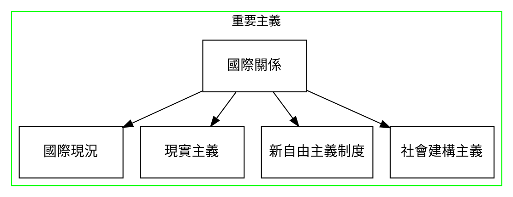
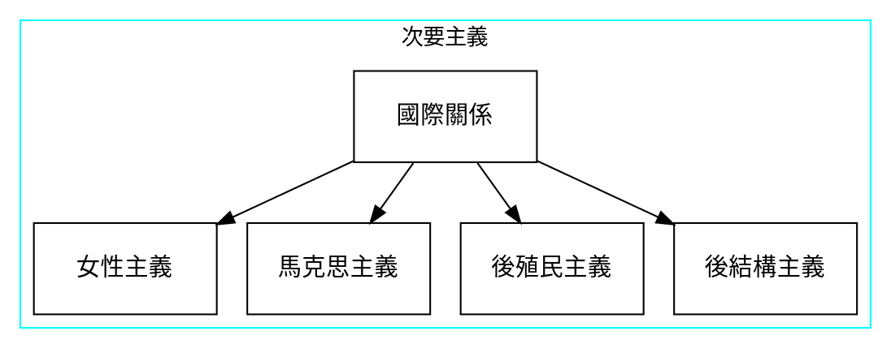
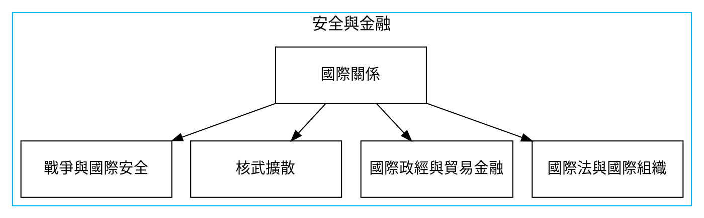
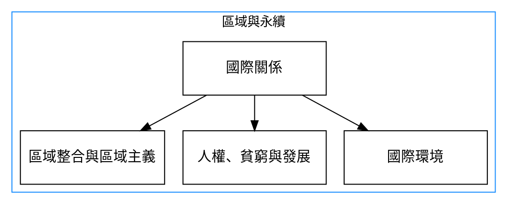
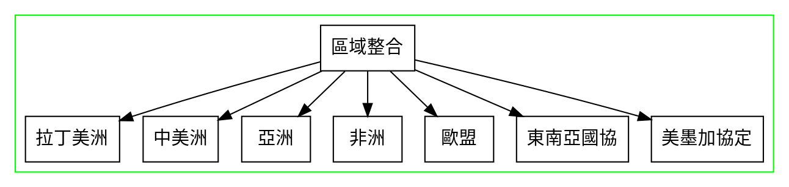

## 大綱

## 一、國際現況
### 1. 困境

### 2. 實力分布
1. 人口數量：中印美
2. 軍事實力：美中英
3. 經濟GDP：美中日
4. 國際貿易：歐中美
5. 研發費用：美中日
6. 論文總數：中美日
:::success
:+1: 大約在2030年至2045年間，中國會變成世界第一強權
:::
## 二、現實主義
### 1. [權力的四個面貌](https://marcushumanities12.weebly.com/uploads/3/7/9/0/37903231/4faces_of_power_summary.pdf)

|                 | 控制結果                                                              | 控制議程                                                                               | 控制偏好                                                                                   | 控制典範                                                                                                                                                                                                       |
| --------------- | --------------------------------------------------------------------- | -------------------------------------------------------------------------------------- | ------------------------------------------------------------------------------------------ | -------------------------------------------------------------------------------------------------------------------------------------------------------------------------------------------------------------- |
| ***principle*** | *A makes B do something B doesn't want to do*                         | *A lets B decide but only provides B with certain choices*                             | *A uses education and the media to convince B that instead of Coke they should have Pepsi* | *A and B both accept the basic assumptions that soda is a private good that requires to money to procure and should come in aluminum cans. Neither A nor B controls the paradigm; the paradigm controls them.* |
| ***neg***       | AB可以利用利誘脅迫控制                                                | 俄國有大選，但普丁藉由控制議程，讓主要政敵失去選舉資格、入獄；控制媒體，讓自己可以選贏 | 中國的文化大革命、再教育營，有些人也會質疑學校制度也是種訓化人民的方式                     | 如果社會化是不讓我們問某些特定的問題，控制典範就是不讓我們知道這是個問題。現代的典範通常是自然科學，讓我們精神上難以擴展                                                                                       |
| ***pos***       | 藉由選舉制度，A B都必須遵守，輸了也要服從，所以可以藉由此制度獲得穩定 | AB也可以藉由建立系統，決定沒有偏見的選項、平等的發聲機會                               | 可以讓普羅大眾產生社會凝聚力，也同時可以提升自我意識、公共辯論等等，而不被中央政權所操控   | 典範改變通常是科技革新，打開了人類了解宇宙的新視野，A B可以設立鼓勵創新、自由想像的政治制度，就可以成為進步的動力                                                                                              |

### 2. 各家論點
- 馬基維利 Machiavelli
    - 「寧受人畏懼而非為人所愛戴」
    - ***Dual*** moral standard ==君王==(領導人)為維護國家利益所依循的道德，==不同於平凡人==的一般道德原則。
- 霍布斯 Thomas Hobbes
    - 自然狀態說，缺乏**最高權威的國際關係環境**，資源有限，所有**個體面對生存與安全不確定性**，就會**暴力**相向
    - 所以可以==利用契約排除個體間暴力==相向，有和平的可能
- 盧梭 Rousseau
    - 批評霍布斯，因為霍布斯所提的[契約論(利維坦)](https://zh.m.wikipedia.org/zh-tw/%E7%A4%BE%E6%9C%83%E5%A5%91%E7%B4%84#%E9%9C%8D%E5%B8%83%E6%96%AF%E7%9A%84%E5%88%A9%E7%B6%AD%E5%9D%A6%EF%BC%881651%E5%B9%B4%EF%BC%89)雖解決了國家與人民間的緊張，但==強化主權==國家間的相對獨立，使國家間進入沒有最高權威，難以處理國家間戰爭狀態
    - 國家間的無政府狀態，才是造成國家間相互猜忌與不安全的主因
:::info
:book: **延伸閱讀**
>***[霍布斯、洛克、盧梭談「我們究竟需要國家做什麼？」](https://www.thenewslens.com/article/100954/fullpage)***
- **霍布斯**：為了避免「所有人對所有人的戰爭」，人類消極放棄部分權力，將權力移轉給權威的一個人，透過他的權力，有能力防止大家互相侵犯，為了國家能夠保障國民的和平與安全，即使將無辜的國民處死，他也沒有義務要說明理由。

- **洛克**：每個人都有「自然權利」，也就是人類知道每個人都有生存、身體不受傷害以及自由與擁有財產的權利，但因為這個權利沒有清楚的規劃，所以在使用的時候就會引起爭端。大家就會聚在一起，形成一個國家，國家有義務透過清楚表達的法則，將自然權利具體化，但國家也不能違反任何一個人的自然權利。所以必須透過權力分裂執行，立法權（給出法則的權力）以及施行機構必須分開，而孟德斯鳩提出三權分立。
- **盧梭**：人在自然狀態中是完全自由的，透過訂立契約的所有人，都必須確實的被平等對待，連一個例外都不能有，所有的政治決策都必須直接詢問所有的國民，只有如此，國民天生被賦予的自由才能被保障，但怎麼可能每個人意見都相同？所以就要保證每個人擁有一樣多，人不只是放棄他們的權利，同時也必須放棄他們的所有物。對國家來說，也同時產生了平均分配社會財物的責任義務。所以我們要奮鬥爭取社會公正，追求一個社會福利國家！
:::
### 3. 現實主義的基本論點
- 無政府狀態 anarchy
- 國家中心論 state-centric -> 忽視國際組織的作用
- ==物質視角==下的權力追求 -> 主要==討論強權==

### 4. 現實主義流派

|          | 古典現實主義                                                         | 結構現實主義                                                                                   | 新古典現實主義                                                                                       | 攻勢現實主義                         | 守勢現實主義                                                           | 
| -------- | -------------------------------------------------------------------- | ---------------------------------------------------------------------------------------------- | ---------------------------------------------------------------------------------------------------- | ------------------------------------ | ---------------------------------------------------------------------- |
| 代表人物 | 摩根索 Hans Morgenthau                                               | 華茲 Kenneth Waltz                                                                             | 史威勒Randall Schweller、施耐德Jack Snyder、格拉瑟Charles Glaser                                     | 米爾斯海默 Mearsheimer               |                                                                        |
| 主要內容 | 由==人性推演==國家行為，所以國家採取抗衡策略，構成國際體系的權力平衡 | 批判古典現實主義，國際體系是由國家與==無政府狀態的結構==所構成，不是由國家單元的個別努力所形成 | 認為國家對國際體系權力分配的認識，==也會受到國家內部==因素的影響，進而左右國家利益，產出國家對外政策 | 國家==安全是永遠缺乏==而且不足的         | 在尋求==安全與生存的保證==                                               |
| 補充內容 | 放諸四海皆準的普世道德是不存在                                       | 國際體系的相對能力分配，造成多極、兩極，但無法解釋冷戰結束，因此產生新古典現實主義             | 見下表格                                                                                             | 透過追求權力的最大化以維護本身的安全 | 權力過度擴張，會引發權力平衡反制，反而對國家不安全，結構現實主義為代表 |

- **新古典現實主義補充**
    
    - 台灣對中國態度(國際壓力)，從**避險**，經太陽花學運，轉為**制衡**
    - 制衡結盟與扈從，是一體兩面，台灣也成為美國(國際壓力)扈從
    - 避險政策是儘量減少在安全的損失，對原有霸權和崛起國兩面討好
- **綏靖政策 appeasement**
    - 滿足對手利益，以換取自我安全
    - 爭取養精蓄銳的時間，也經由互動交往，改變對手國的偏好
    - ex:美中過去交往
- **單極穩定論**
    - Wohlforth
    - 全球權力==集中單極==(unipolarity)，和平穩定且持久
- **權力轉移論 Power Transition theory**
    - Organski and Kugler
    - 國際體系是依照實力排列的「層級體系」（hierarchical system）
    - ==崛起國終會不滿其受壓抑==，發生霸權戰爭
- **霸權更迭論**
    - Gilpin
    - 國際體系的主宰霸權，受內外因素影響而==霸權衰退，鼓勵崛起國==挑戰其霸業，進發生霸權戰爭
- 衰退霸權為維護其地位，會採取==預防戰爭先對崛起國發動戰爭==（Copeland, 2000）

## 三、新自由主義制度
>偏好
:::danger
利用經濟關係彼此合作，彼此融合，避免衝突
:::
### 1. 三波自由主義發展
1. 十九世紀的哲學家和改革者
2. 兩次世界大戰期間的理想主義
3. 當前自由國際主義面臨的危機
### 2. 早期概念
- 威爾遜：通過制定限制自身利益的國際規則，來解決戰爭問題
- 邊沁：平等國際法，建立幸福
- 康德：聯邦政府
- 民主和平論：民主國家之間不會有戰爭
    - 但如何定義民主，朝鮮民主主義人民共和國？
### 3. 新自由制度主義
- 關注非國家行為者（國際組織、非政府組織甚至個人），在國際體系中所扮演的角色與作用
- 強調無政府狀態下的國家合作，以及國家間經貿互賴反映的權力關係。
### 4. 國際制度
- 新自由制度主義不再堅持國際互動的多元性
- 開始討論國家之間合作的制度
- 目標：改善國家被「欺騙」的現象，制度化可以增加互賴、獲益
- 如：北約、WTO...
- 一般認為貿易量越高，越有可能促使敵對國家放棄先前的敵視態度，轉而合作互利。
    - 此即為經濟互賴的貿易和平論。
    - 但若兩個國家具有敵意，則經貿互賴促進和平的可能性有限。
        - 美中貿易戰
        - 兩岸緊張關係
- 自由主義國際秩序是過去大國之間達和平的主因，美國是建構的主要動力
### 5. 批判
- 忽視國際體系中的權力和利益分配
- 列強的帝國衝動，仍持續存在
- 向國際制度讓渡實質性決策權，在自由主義國家內部造成了重大的政治問題
- 全球化幫助其他國家變強，破壞美國單極格局，終結自由主義國際秩序
:::success
:warning: 自由主義注重收益增加，現實主義注重權力分配，所以現實主義認為合作並不影響，因為權力關係保持一樣，國家之間一定要再競爭。
:::
## 四、社會建構主義
> 觀念
:::warning
:-1: 現實主義與自由主義的觀點，行為者會構成系統，但在構成系統後，單位就被系統控制，行為者也就無法改變了，所以我們就是往上研究源頭的原因，是有定理定則的。

:100: 但社會建構主義認為，系統與行為者是相互影響的！
:::
### 1. 核心概念
- 國際體系最重要的本質為社會結構，而不是物質結構
    - 乃是能動者(agent/國家)透過實踐(practices)的互構而成
    - 國際社會體系之構成：物質+共享知識(結構/文化)+能動者實踐
- 隨著時代，殖民開化的觀念改變，因為人心會變異，所以制度、行為也會跟著改變，就是行為者影響系統
- 根據社會建構主義，行為者可以影響國家行為，行為者觀念意識不停改變，所以每種未來都有可能發生，物質不再是衡量利益價值的唯一選擇
    - ex：孔孟捨生取義影響國家。
- 因此，社會發展應該是發散的，但西方思維卻是有意無意地往單一方向發展，無法解釋
- 社會化、集體觀念的塑成，反而有時候比物質方面更難打破架構。
### 2. 觀念與國家行為

:::warning
- 規則的種類
    - 管制性規則
        - 規定何者為**可行**行為
    - 構成型規則
        - 界定行為者的**認同**，為這些活動創造可能性
- 兩種邏輯
    - 後果邏輯
        - 行動歸因於預期的成本與**收益**
    - 適當性邏輯
        - 突出行為者如何遵守規則並關切其行為的**正當性**
:::
- 擴散：特定的實踐、規範或信念在人群中是如何被傳播的
- 制度同構：共享相同環境的組織，會隨著時間的推移彼此相似
- 社會化：國家如何地改變成員的行為，使其與群體的行為一致
### 3. 所理解的權力
- 文化(culture)決定人們賦予其實踐(practices)，這裡的實踐不是只**行為**，實踐是強調有意義
- 意義是一種政治成就，亦同時是權力的展示
- 具備觀念成份
- 溫特的三種無政府文化
    > Anarchy is what states make of it. 無政府的樣貌是國家所理解出來的。（make of 不是造成，是理解！）
    > [name=溫特]
    - 溫特表示，在無政府之下，**如同無政府狀態下的人際互動**，國家之間的關係**不是如現實主義者所說，只會有敵對的關係**，而是呈現出三種樣貌：
        :::success
        - **敵人**（霍布斯）：敵人之間自立自助
        - **對手**（洛克）：對手之間雖有他我之分，但存在著基本的主權認可及尊重，不會輕易發動侵略性行動
        - **朋友**（康德）：朋友之間會以非暴力之方式解決紛爭，並且合作對抗第三方
        :::
- **規範**的生命週期
    > 1. 出現（推廣）：推廣者將**規範放入框架及議程**，試圖說服他人接受規範
    > 2. 串接（採納）：社會上人彼此之間因為各種原因（同儕壓力、正當性、尊嚴等）而**採納規範**
    > 3. 內化（習慣）：當超過一定人數的人採納該規範後，**規範變習慣成自然**，成為生活中的一部分，不會有推拉、不會有爭議
## 五、女性主義
### 1. 女性受偏見與歧視的例子
- 握有高位的女性常被要求要壓抑著女性氣質，展現出符合男性氣質
- 語言中通常指稱雄性的詞會作為預設，而其雌性的相對則會另外置標，例如：
    - man是男人，而女性則要另外置上 wo- 這個標記
    - 「彼」是日文用來以第三人稱只成男性的詞，但若指稱女性就一定要加個女變成「彼女」
    - 很多語言裡，表示「男人」的詞同時可表示「人類」，如法文 homme, 西文 hombre, 而對「女人」則是另外用別的詞
    - 中文的「他」是以人字為部首，「她」則以女部
    - 「兒子」是男性，若要指稱女性，就要很直白(explicit)地用上「女」這個字：「女兒」
### 2. 各種女性主義
| 主義 | 內涵 |
| -------- | -------- |
| 自由女性主義 | 主張**將男性享有的權利與代表權擴及到女性**。別將性別差異視為理所當然，而是要去探討起源、理由 |
| 批判女性主義 |**凸顯政經社會對權力關係的影響**，尤其經濟（受馬克思影響）。性別與階級壓迫，兩者關係緊密，對「男女本質上有差異」保持懷疑的態度。（性別本質主義 Gender Essentialism) |
| 後殖民女性主義 | **將性別壓迫與殖民做出連結**，西方國家對「落後國家」輸出女性主義的態度本身也是一種「父權」的展現|
| 後結構女性主義 | **語言對性別偏見的建構作用**，sex 是由 gender 構成，而非反過來 |
## 六、馬克思主義
### 1. 基本觀念
- 整體分析(Holistic analysis)：全球社會應是整體地分析。
:::danger
:knife: 歷史唯物主義：歷史變遷的過程，反映**社會經濟的發展模式**，尤其是 **生產材料(means of production)與生產關係(relations of production)** 的緊張。
:::
- ==物質視角==所詮釋的歷史與國際社會。
- 國際事件乃是在結構上，受到全球資本主義的影響。

| 生產材料 | 生產關係 |
| -------- | -------- |
| means of production | relations of production |
| 勞動者進行生產時所需要使用的資源或工具，包括勞動資料（例如土地、廠房、機器、工具等）與勞動對象（如原料）兩大類| 社會生產過程中形成的人與人的關係 |
| 生產工具的變革，是社會生產力水平最主要的標誌 | 三個面向：生產關係是一種複雜的經濟結構，包括生產所有制形式、各種社會集團在生產過程中的地位、產品的分配 消費關係 |
- 階級鬥爭：
    - 階級衝突是歷史發展的關鍵決定因素
    - 所有社會的歷史都是階級鬥爭的歷史
    - 分析者不應該超然與中立，有道義上的義務，讓事情變得更好
    - 解放(emancipation)概念，是任何社會理論的關鍵。解放是給予人們政治或社會自由權利的過程
### 2. 從帝國主義到世界體系理論
- 列寧聲稱現代資本主義導致一個主導中心-被剝削邊陲的兩層體系
- 所有勞動者之間，不再有自動地利益和諧，正如馬克思所假設的，被剝削的邊陲工人可以 “補貼”中心的工人。
- 依賴理論(dependence theory)：
    - 拉丁美洲等邊陲國家因不平等交換的依賴關係而無法翻身
    - 中心國家則透過此關係，維持較高所得及外貿優勢，使中心國家與邊陲國家差距難以縮小。
- 世界體系理論：
    :::info
    增加了**半邊陲**的概念，作為世界體係政治結構中的穩定因素，連接這三個區域的剝削關係，確保“富者更富，窮人更窮”。
    > 核心 → 半邊陲 → 邊陲
    > 
    :::
- 葛蘭西主義 (Gramscianism)
    > 為什麼在西歐推動革命如此困難？
    - **上層主宰結構的出現，是強制與同意(consent)的結合**
    - 被統治階級認可或是接受社會統治階級所**創造的道德文化與政治價值**，其工具是公民社會與制度網絡
    - 葛蘭西主張，要進行一場**反霸權鬥爭**，進而建立了一個新的歷史集團
- 世界秩序(Robert Cox)
    - 問題解決理論(problem-solving theory)：假設 **知識是客觀和永恆** 的
    - 批判理論(critical theory)：理論是 **為了某些人或為某些目的，而被創造的** ，事實和價值並 **不明確**
        - 批判理論視野下，資本主義被曝露為一個內在矛盾且不穩定的體系
        - 批判理論起源於馬克思主義與法蘭克福學派，但並沒有整體的理論概念
        - **關注上層結構**（文化與社會固有的壓迫結構），而非一般的經濟基礎
        - 質疑工人階級是否有變革的力量，因為它已被剝削霸權體系所吸容
        - 批判理論試圖更好地理解暨定義「解放」
    - 霸權是為現有秩序 **創造同意的工具**
    - 對理解國際秩序之存續與轉變，提供一個新的途徑
    - 對自由主義國際秩序的新解？
        
## 七、後殖民主義
> 後殖民主義與去殖民主義，是批判理論的一支，企圖 **發展自我的國關理論**
### 1. 基本定義與根源
| 後殖民主義 | 去殖民主義 |
| -------- | -------- |
| 常與亞裔非裔聯繫 | 主要為拉丁美洲思想家耕耘 |
| IR 中發展最快的研究領域，洞察**現代世界被帝國殖民歷程**，所構建的現象 |觀察二十世紀的殖民帝國，從亞洲、非洲、加勒比與南美洲**撤出的過程**。 |
- 結合三個理論研究
    - 認識論 (Epistemological)
        > 強調 **從被帝國、種族等級制度剝削的人與權力視角**，`how we think about and know the world`
    - 本體論 (Ontological)：
        > 強調 國關理論中 **忽視非西方人民與政體、也忽略帝國與殖民主義的影響**，`what we study?`
    - 規範性 (Normative)：
        > 將支持西方優越性的態度，理解為**不平等、種族主義與非人性化**
- 根源：
    - 一樣的**歷史根源**、對西方帝國歷史的**共同理解**
    - 反殖民運動、反抗
    - 受到馬克思主義對帝國主義、資本主義的批評所產生的跨國影響
    - 尋求獨立期間與獨立後的第三世界**認同**
- 主要觀點：
    - 殖民主義一種**暴力體系**
    - 而新殖民主義是關於經濟與政治結構
    - 歐洲中心主義被視作 知識習慣
    - 去殖民作為推**翻殖民主義與殖民的實踐**
### 2. 邊界思維（Border thinking）
> 作為一種去殖民式的思維方式
- 分析民族國家會帶來的拘束
- 建立／恢復一種 **多元並存的現代性認識論**
- 相反的就是 **預設「邊疆」的認識論**，假設邊疆外的地方是「空無一物的化外之地」，是一個得以征服、文明化的空間，而 **領域認識論** 是帝國的認識論，透過現代性的話語，合理化、正當化殖民性
### 3. 其他概念
- 失敗國家：
    - 擁有主權國家之名，卻沒有國家內部治理能力，而需要西方列強的干預
    :::success
    :+1: 後殖民批判：**不應忽視前殖民統治者所遺留的經濟結構**，忽略戰爭、鎮壓與種族滅絕在建構西方式主權國家過程中的作用。
    :::
- 西方權力衰微後的思維：
    - 不同世界秩序的帝國，**關係依舊持續**：例如全球制度、國際貿易、西方認同、軍備控制
    - 概念工具也可以批判性地應用於**非西方政府的行為**
## 八、後結構主義
### 1. 基本看法
- 我們**無法透過因果關係**，來理解世界政治
- 政治結構，是經**由人類行為實踐**所建構，它不能被視為獨立變數
- 所以後結構主義**不是因果式的解釋性理論**，而是[**建構理論**](https://hackmd.io/8MitD_JsRu64rmsJ6Krflg?both#%E7%A4%BE%E6%9C%83%E5%BB%BA%E6%A7%8B%E4%B8%BB%E7%BE%A9)，也**不是基礎主義**
    :::warning
    :-1: 解釋性理論 (explanatory)：**定義理論概念**，解釋它們之間的聯繫，並指導我們如何在世界政治分析中使用它們。
    
    :-1: 基礎主義 (foundationalist)：提出理由或證據，支持某個主張的真實性或正確性。**主張知識的證成**，是由最基本的知識作為起點，並且基於合理的信念，經由合理推論，推斷出結論。
    :::
### 2. 建構的元素
- 論述(Discourse)
    :::danger
    透漏我們對事物與事件的看法，透過論述結構化我們的思想
    :::
    - 不是中性的傳遞，而是意義的產生者
    - 語言建構事件，所以語言**不具客觀的意涵**
- 解構(Deconstruction)
    - 字詞的符碼(codes of words)**永遠不會真正固定**，因為字詞之間的連結(意義的創造)，從來不是給定的
    - 可以進一步去思考，為什麼語言會這樣使用 ex:等級式的用詞二分法(文明 vs 野蠻)，我們有沒有其他開放替代的用法
- 系譜(Genealogy)
    :::info
    考察實際發生的事物本身，以本來面目還原歷史
    :::
    - 何種政治實踐形成了現在？
    - 為何其他的理解與話語被邊緣化，並經常被遺忘？
    - 何種建構具有主導地位？
    - 這些建構如何與過去的論述相互連結？
- 權力
    :::success
    當論述將特定主體位置(*particular subject positions*)建構為自然位置(*natural positions*)時，就會產生權力。
    :::
    - 政治行為者不存在於論述之外
    - **話語總是與權力聯繫在一起**，知識或真理，是由權力所造就，隨即它又產生權力功能，從而進一步鞏固了權力，構成管理暨控制的**兩位一體**，對主體進行建構塑型
- 互為文本性(Intertextuality)
    :::warning
    世界是由本文(*texts*)組成，而文本的意義又由其他的文本所構成
    :::
    - 流行文化與新聞發言 就是一種文本，因為它們鏈接到其他的文本
    - 互文性也包含圖像，或詮釋方式不以書面或口頭的事件
### 3. 國家主權、認同與外交
- 國家主權：
    - 可以被概念化為將世界劃分為
        - 國家的內部(inside) - 存在**秩序、信任、忠誠和進步**
        - 國家的外部(outside)- 存在**衝突、懷疑、自助與無政府狀態**
    - 但此種二分法，本質上是任意且**不穩定的**，必須不斷地**具體化**(reified)。
        :::warning
        ⚠️ 後結構主義警告，所謂「普遍性」價值，是由特定觀點構成/表達
        :::
- 國家認同：
    :::info
    :+1: 國家之認同，乃是由其**外交政策所構成**，並不是一個客觀的立場
    :::
    - 經由**構建威脅/危險**之他者，**構成自我的身份認同**
    - 國家身份認同依賴於**話語實踐**
    - 國家的身份認同，是建構性與表演性的
    - 國家身份認同既是外交政策的產物(果)，也是外交政策的理由(因)
- 主體性/主觀性(subjectivities)
    > 跟上方的國家認同很像
    - 身份認同不是某人擁有的東西，而是通過社會語言過程所構建
    - 身份認同是關係性與表演性的
## 九、戰爭與國際安全
### 1. 定義
- 戰爭是群體間**有組織的暴力**，某方試圖屈服對手之意志，使其不能反抗
- 它是依據某種**戰略或計劃**，為某種**目的**而戰
- 戰術(*tactics*)是武裝部隊用以**贏得戰鬥的技術**

| 內戰 | 國際戰爭 |
| -------- | -------- |
| 內部團體爭奪主權國家的控制權，或者一個或多個團體，意圖分離於某個主權國家     | 兩個或多個主權國家間的相互爭鬥     |
- 戰爭反映了全球化，並可能產生全球影響
- 全球化已經模糊區別
    - 目前內戰包括不同的國家與**非國家行為體**
    - 反恐戰爭導致**不同國家**在情報、警察與軍事加強合作

### 2. 戰爭理論
- 孫子兵法：
    - 慎戰、謀略為主
    - 爭取「全勝」，故上兵伐謀，其次伐交，其次伐兵，其下攻城
    - 不戰而屈人之兵
- 克勞塞維茲 **`戰爭論`**：
    - 戰爭乃政治的延續
    - **戰爭三位一體論**
        | 激情 | 機會 | 原因 |
        | ---- | -------- | -------- |
        | passion | chance|reason   |
        |人與人之間對戰爭的信念|戰爭測試軍隊能力的考驗|政治領導層決定戰爭最終目標 |
    - 
        | 全面戰爭 | 有限戰爭 |
        | -------- | -------- |
        | total war  | limited war  |
        | 為國家生存而戰    | 為次於生存目標而戰, 例如領土爭端    |
    -  
        | 實際戰爭 | 真實戰爭 |
        | -------- | -------- |
        | real war  | ture war, absolute war  |
        | 就是真實的戰爭|  *Philosophical exploration of war.* Absolute war was characterized by very high levels of energy and professional competence, and it aims at the destruction of the opposing force and the attainment of a political decision by force of arms.|

### 3. 戰爭與國際社會的發展
| 時期 | 特色 |
| ---- | ---- |
| 中世紀的歐洲 | 裝甲騎士與支離破碎的政治權力|
| 文藝復興 |步兵的出現與軍事技術的進步，**財政軍事循環**催生了現代領土國家民族認同的興起|
| 法國大革命 | 引入**徵兵制**；民族國家與大型跨國帝國的共存 |
| 工業革命 |**工業化**，使真正的全面戰爭(total war)成為可能
| 世界大戰 |在世界大戰期間，**民族國家是進行戰爭的載體，但戰爭也超越了民族國家**；產生軍事同盟；核武→冷戰 |
| 冷戰後 | 列強縮減傳統武裝力量，轉而關切**核武器擴散** |
- 南方國家
    - 16 世紀以來的歐洲戰爭與社會是，涉及**帝國建設(empire building)**，而非國家建設(state-building)
    - 歐洲擔憂**殖民人口**與帝國擴張，會對帝國統治的挑戰，因此組建武裝部隊
    - 被殖民者**獨立後**，許多武裝部隊與前殖民國，保持密切聯繫（軍事援助）
    - 在**內戰與外國干預**的背景下，**繼續使用武裝部隊**，以維護國內安全
- 當今的戰爭與國際社會
    :::info
    戰爭的**國家性、國際性與全球性**層面，已經聯繫在一起
    :::
    - 美國國對**非國家行為者 9/11 恐攻的回應**，美國及其盟國入侵阿富汗與伊拉克
    - 與過去的延續，全球**南方國家的安全援助**與軍事訓練
    - **戰爭與警務**之間的界限變得模糊，如增加中的空襲與無人機打擊
    - 國內社會的警察行動，以**打擊恐怖襲擊**威脅
### 4. 安全
> 安全是一個有爭議的概念
:::warning
🏘️ 安全意味**個人與群體的核心價值**，不受到實體的威脅，主要關注焦點是**個人、國家、國際或全球**，但仍有不同看法......
:::
- 指涉的對象與層次
    - **冷戰期間，重點主要是國家安全**，以及應對當前威脅所需的軍事能力
    - 擴展安全的概念，包括政治、經濟、社會、環境以及軍事的層面
    - 而國家安全和國際安全是否可以兼容?
- 安全議題的轉變
    - 後冷戰時代所萌芽的之全球社會的出現，強調國家與國際安全，曾一度顯得不合時宜
    - **全球化的發展**，導致新的風險與危險，包括
        - 國際恐怖主義
        - 全球貨幣體系的崩潰
        - 全球暖化
        - 網絡衝突與核擴散的危險
    - 面臨地緣政治的再興？
- 傳統的國家安全視野
    - 從西發里亞條約開始，國家被視為「自助」世界中最強大的參與者
    - 許多思想家對國家主權的影響持悲觀態度：擁有主權的國家，不可避免地會發展進攻性軍事能力來保衛自己，因此相互之間存在潛在危險
    - 所有國家都需要平衡其他國家的權力，以防止任何一個國家實現全面霸權
- 不同理論對國家安全的看法
    | 理論者 | 觀點 |
    | ------ | -------- |
    | 結構現實主義者  | 國家安全是國際體系結構的結果，無政府狀態的結構具有高度的維持性  |
    | 新自由制度主義論者 | 重視國際制度，並認為它們在加強安全方面發揮著關鍵作用 |
    | 社會建構理論者  | 國際政治的基本結構是社會的，而不是嚴格的物質結構，國家之間社會互動性質的變化，可以帶來向更大國際安全的根本轉變 |
    - 社會建構理論者例子：北約式的安全社群(security community)是共享知識與身份認同的一個例子，在安全社群中，各國相互信任，無需戰爭即可解決爭端。
- 非主流的安全觀
  | 理論者             | 觀點                                                                                                           |
  | ------------------ | -------------------------------------------------------------------------------------------------------------- |
  |批判理論     | 關注於關係與制度的出現方式，以及可以採取哪些措施，以改變它們                                                 |
  | 批判安全研究(Critical security studies )  | 個人而非國家，才應該是分析的核心。         |
  | 人類安全擴大安全  |  包括貧困、疾病和環境退化等領域   |
  | 女性主義 | 應將性別納入國際安全研究 |
  | 後結構理論     | 思想、論述與與詮釋邏輯，對於理解國際安全至關重要 |
- 全球化與地緣政治(geopolitics)的再起
    - 全球化面臨重大挑戰，而且強調地緣政治的作用
    - 全球化與地緣政治是否相容的爭論
        - 對立論：地緣政治涉及國家與帝國對空間和資源的控制，而全球化涉及商品、資本與思想的自由流動。
        - 兼容論
    - 全球化帶來了更大的和平與安全
    - 隨著現狀受到挑戰，全球化導致更大的分裂暨衝突
## 十、核武擴散
### 1. 核武國
| NPT 界定的核武國 | 未加入 NPT 的擁核國 | NPT 視為非法的擁核國 |
| -------- | --- | -------- |
| 美俄英中法      | 印度、巴基斯坦、以色列| 北韓 |

- 核技術的軍民兩用性：
    - 用來產生能量
    - 製造武器
- 製造核武器的主要障礙：**獲得武器級裂變材料**，它涉及複雜的技術過程，且需將武器級裂變材料**武器化**，製成可以運送到目標的彈頭
### 2. 核武戰略
- 冷戰：美蘇兩極建立大量核武器庫
    | 戰略 | 英文 | 內容 |
    | ---- | --- | ---- |
    | 核嚇阻、核威懾 | Nuclear deterrence | 防止超級大國之間的傳統戰爭或核戰爭 |
    | 先制戰略 | Counterforce strategy |先發制人攻擊對手的核武器設施，以解除對手的核戰力→**以核武為攻擊目標** |
    | 反價值戰略 | Countervalue strategy | 針對對手的人口、知識、經濟或政治資源，動用核武→**以城市和人為核武攻擊目標** |
    | 延伸嚇阻 | extended deterrence | 如果第三方盟國被攻擊，將以全面核反擊回應 |
- 核武軍控協議
    | 軍控協議                                                                | 內容                                                                                                                                                                                                                                                                                                         |
    | ----------------------------------------------------------------------- | ------------------------------------------------------------------------------------------------------------------------------------------------------------------------------------------------------------------------------------------------------------------------------------------------------------ |
    | SALT I(1972)、SALT II(1979)、以及中程核武協議                           | 美蘇限制核武部署與彈道導彈防禦                                                                                                                                                                                                                                                                               |
    | START I(1991)、SALT II(1993)                                            | 美蘇減少雙方的核武庫存量                                                                                                                                                                                                                                                                                     |
    | 新削減戰略武器條約 New START                                            | 美俄目前效期到 2026，核彈頭數量不超過 1550 枚等等                                                                                                                                                                                                                                                            |
    | 美英俄《布達佩斯備忘錄》1994                                            | 尊重烏克蘭的獨立、承諾不對烏克蘭使用武力、如烏克蘭面臨或遭到侵略危險，三國將立即推動聯合國安理會採取措施，對烏克蘭實施幫助、不對NPT的非核武器締約國使用核武器的義務                                                                                                                                          |
    | 禁止核武器條約（Treaty on the Prohibition of Nuclear Weapons） | 禁止核武器的擁有、研發、儲存、轉移、試驗，或是威脅使用核武。美中俄英法等核武國反對。日本等國未加入。 |
    | 禁止核擴散條約(Treaty on the Non-Proliferation of Nuclear Weapons, NPT) | 核武國：美中俄英法五國，被NPT列為核武國，承諾不以任何方式協助任何非核武締約國製造獲取核武器。 五國進行**核裁軍談判**，安理會聲明，不以核武攻擊非核國。其他締約方，不得研發、持有或部署核武，且應接受IAEA之核保防(safeguards)措施，查核其民用核設施暨物料情況。 |
    :::danger
    :-1: 對NPT的批評
    - 不普遍（印度、以色列與巴基斯坦從未簽署；北韓簽署後又退出）
    - 執法效能不彰。
    - NPT是不平等條約，給予五個核武國家的擁核地位暨特權，損害其他國家的利益
    :::
- 絕少使用核武的原因
    - ==核嚇阻== (Nuclear deterrence)
        - 支持者：即使有限的核打擊能力，也能阻止國際衝突
        - 批評者：核嚇阻的效果，已被核武擴散與不安全感所抵消
        - stability–instability paradox： 核強權對大規模攻擊感到安全，或因此可以隨意進行小規模挑釁
        - 但核嚇阻的效果，是否對所有國家都有一致性？
    - ==核禁忌== (Nuclear taboo)
- 發展核武國的境遇
    - 台灣、南韓、巴西、南非等國，為美國所阻止
    - 印度、巴基斯坦均成功發展核武與投射系統
    - 北韓在聯合國制裁下，仍成功發展核武暨投射系統
- 核安保(nuclear security)的合作
    > 2003 防擴散安全倡議，旨在加強國際合作，以阻止大規模毀滅性武器材料暨運載系統的販運與轉讓
     2004 聯合國安理會決議，防止非國家行為者獲得大規模殺傷武器
     2010 核安全峰會，加強合作，防止核走私
- 北韓的擁核歷程
    > 1985 北韓加入NPT
     1993 有意退出
     1994 框架協議：北韓關閉核反應器，換取美國援助
     2001 美國未履行1994協議
     2003 北韓退出NPT。召開六方會談
     2005 六方會談聯合聲明，確認朝鮮半島無核化目標
     2006 北韓試爆核武。2007年，六方會談停止
     2009-今 一系列核武與彈道飛彈試驗
     2017 北韓宣稱成功製造氫彈
     目前北韓飛彈已可核打擊美國等遠程目標
     聯合國安全理事會通過一系列經濟與金融等制裁措施
- 伊朗的去核化談判
    > 伊朗是 NPT 會員國
     2003 IAEA報告伊朗未能按要求申報濃縮活動，安理會要求伊朗停止這些活動
     2011 IAEA 報告稱伊朗進行與核武相關研究
     2015 伊朗與五個安理會常任理事國暨歐盟達成聯合綜合行動計劃 (JCPOA)，在伊朗限制其核濃縮設施數量前提下，解除對伊朗制裁
     2018 美國川普政府退出JCPOA
     持續談判中
## 十一、國際政經與貿易金融
> International political economy
- 專注於**經濟和政治**在世界事務中的相互作用。
- 主要討論**貿易、生產與金融**，但也涉及**發展、不平等、環境與移民**。
- 最近，該領域關注**私人與公共權力**之間的相互作用，這些新觀點包括：
    - 社會建構主義
    - 理性選擇理論與制度主義的演變形式
    - 新葛蘭西主義
    - 女性主義
    - 後結構主義
### 1. 國際政經的途徑
- 三個獨立的傳統在歷史上占主導地位：
    | 舊三主義 | 內涵               |
    | -------- | ---------------------- |
    | 自由主義 | 關注==自由貿易==與市場效率 |
    | 民族主義/現實主義 | 著眼於國家間==權力==和安全最大化的競爭，強調霸權在全球政治經濟中的作用 |
    | 馬克思主義  | 將世界經濟關係視為壓迫者與被壓迫者之間的==階級==鬥爭，並將資本主義視為全球政治經濟的結構 |
- 
    | 新三主義 | 內涵               |
    | -------- | ---------------------- |
    | 女性主義 | 關注支撐全球政治經濟的權力結構、利益與思想，如何在性質和後果上，從根本上被==性別==化 |
    | 社會建構主義 | 探討==思想==如何塑造全球政治經濟的結果；一些人關注意識形態的作用，而某些人則關注定義行動者偏好的利益|
    | 新葛蘭西主義  | 將馬克思主義就支撐資本主義的權力結構，與構成全球政治經濟結構的「==意識形態==」相互結合 |
### 2. 全球化
- 自 16 世紀以來，全球化經歷許多階段
    - 二戰結束奠定戰後國際經濟秩序
    - 嵌入式自由主義(Embedded liberalism)，並構建國際化的架構
        > 1. 社會支持自由化的國際經濟政策
        > 2. 國家則通過社會和政治安全網建設
        > 
        > 國家和社會之間所達成的上述國內契約，減輕這個政策所帶來的有害的國內經濟效應，其中一個有效的手段就是通過稅收和財政支出計畫，調節自由市場經濟所帶來的財富在不同社會群體中的不均衡分配
    - 布列敦森林體系(Bretton Woods system)(IMF、世界銀行、GATT → WTO)
        > 1944年7月至1973年間，加入以美元作為國際貨幣中心的貨幣制度
        > 對各國就貨幣的兌換、國際收支的調節、國際儲備資產的構成等問題共同作出的規則
    - 歐洲整合的深化(羅馬條約  → EEC → EU)
- 新自由主義的反撲
    - 1970 年代：黃金時代結束， 滯脹，發展中國家認為布雷頓森林制度損害其利益
    - **不結盟運動** (Non-Aligned Movement, NAM) 與**國際經濟新秩序** (New International Economic Order, NIEO) 出現在 1960-70 年代，以**減少發展中國家對國際經濟的依賴**
    - 華盛頓共識(Washington Consensus)：1980年代**債務危機**引發新自由主義反撲，在全球範圍內推動貿易自由化、放鬆管制和私有化
    - ex: 陷於債務危機的拉美國家急需進行國內經濟改革。美國邀請國際貨幣基金組織（IMF）、世界銀行（WBG），旨在為拉美國家經濟改革提供方案和對策
- 四種動能解讀
    | 動能 | 內涵 |
    | -------- | -------- |
    | 思想與意識形態 | 新自由主義和全球化被建構 |
    | 強大的利益與制度 | 企業利益，尤其是跨國公司，儘管國家與國際制度仍然制定規則。 |
    | 技術革命 | 壓縮時間與空間，允許更大的國際經濟交流 |
    | 國家的力量 | 重點從美國轉移到包容中國；以前將強國視為全球化的助力，但今日此種說法已遭到質疑 |
- 全球化的贏家與輸家
    - 不平等
        - 新自由主義全球化將使世界人口擺脫貧困的期望是錯誤
        - 即使取得進展，分佈也極不均衡
        - 某些人認為全球化動力本身，是造成不平等加劇的原因
    - 勞工剝削
        - 勞工剝削是不平等之表徵
        - 全球生產建立於利潤極大化的目標，引導企業與投資方**尋找廉價、靈活的勞動力**，**非正規、移民與契約工**已成為全球勞動力的中堅力量，這些工作是不穩定且不受保護
        - 勞動力的**女性化**(Feminization)，意味**女性是最脆弱**的群體之一
        - 全球有 1.52 億童工，國際勞工組織估計有 2,490 萬人在**強迫勞動**條件下工作(2017 年)
        - 強制勞動有下列型式：
            > 缺乏正式契約
             債務操縱
             可能無法支付的預扣工資
             工人想離職時面臨監禁威脅
             限制自由行動
             威脅或實際使用暴力
    - 移民
        - 移民可以被視為全球化的贏家和輸家
        - 移民本身就是全球化的驅動力
        - 移民全球化，高流動性、高收入且高教育程度的移民表現良好；而其他人則在**低薪、低技能的職位上受到剝削**
        - **農民工**很脆弱，因為他們往往缺乏政治權力與權利
- 全球化的未來
    - 由於**反全球化、本土主義與民粹主義政治壓力**的興起，全球化的未來現在飽受質疑
    - 全球化擱淺的三種看法
        > 1. 全球化力量十分強大，造成現狀的持續維繫
        > 2. 只有新自由主義全球化陷入困境
        > 3. 或許會出現另一種全球化模式
- 金磚國家
    > 1980年代以來，印度與中國經濟急劇增長
    > 2001年發明金磚四國一詞（巴西、俄羅斯、印度、中國，有時還包括南非）
    > 2016年人民幣納入IMF儲備貨幣，中國是美國國債的最大外國持有者
    > 2018年以來，中美貿易緊張局勢加劇，中國崛起是否意味著新的全球政治經濟秩序？或是對新自由主義統治暨美國的挑戰？
### 3. 金融與貿易
- 全球化全球貿易和金融流動(flows)包含兩個層面
    | 層面        | 解釋 |
    | --------------- | -------- |
    | 強度(Intensity) | 流動**跨越國家經濟邊界的程度** |
    | 廣度(Extensity) | 流動的**地理分佈** |
- 自 1970 年代危機以來，它已成為**強化國家市場整合**的代名詞
- 流動強度
    - 全球化熱點以**發達工業國家為中心**，跨境經濟活動顯著加劇
        :::info
        💰 貿易的重力模型(Gravity models of trade)：
        假設經濟規模與距離，是影響貿易的主要因素，**貿易額與國家經濟規模成正比**
        :::
    - 相對地，世界上許多最貧窮的國家，或多或少沒有受到新經濟結構的影響
    - 世界貿易的增長只是部分倖免於 2007-8 年全球金融危機的影響
- 流動廣度
    - 一個國家在**區域貿易協定中的根基越深**，廣度增加的可能性就越大
    - 區域集團內的擴展效應，幾乎肯定會比其邊界以外更顯著
    - 自 1970 年代以來，世界貿易的大幅增長，在很大程度上可以用**區域經濟整合**而非「真正的」全球化來解釋
- 金融全球化
    - 金融市場的交易，很少涉及貨幣的實體易手
    - 外商直接投資(Foreign direct investment, FDI)是金融領域擴展性最明顯的例子，然而，「紙面」金融交易量巨大，遠超全球貿易流量
- 避稅天堂
    - 避稅天堂允許高財富個人與公司，利用稅收漏洞
        | 民粹民族主義者 | 自由全球主義者 |
        | -------------- | -------- |
        | 全球精英拒絕遵守支配國家社會的法律 | 破壞全球治理結構的完整性  |
    - 許多避稅天堂是低度國家。認為應該允許其運用比較優勢
    - 避稅天堂抑制全球稅收，從而減少海外援助預算
- 國際貿易的監管-GATT到WTO
    > 1944 布雷頓森林會議旨在設計一種戰後治理，以防止世界經濟陷入蕭條
    > 1947 關稅和貿易總協定 (General Agreement on Tariffs and Trade, GATT) 成立，其授權比某些人預想的要弱。GATT 體系變得越來越笨拙，因為延長雙邊關稅減讓的談判，必須與每個第三方單獨進行
    > 1995 GATT 被世界貿易組織 (WTO) 取代，現有164 個成員和 25 個觀察員(2021 年)，一方一票制，WTO旨在將自由貿易規範嵌入具有多邊影響的國際法，基於比較優勢邏輯，理論上對所有成員都有利。批評者稱，WTO更好地有利於強權而非弱勢會員國的比較優勢。
### 4. WTO
- WTO基本原則
    | 原則 | 內涵 |
    | -------- | -------- |
    | 最惠國待遇(Most-favoured-nation, MFN) |==平等對待他國==，依據WTO協議，各國**不能歧視其他貿易夥伴**，如果給予某國特別優惠，例如對某種產品降低關稅稅率，亦必須對所有其 他 WTO 成員亦同樣適用。|
    | 國民待遇(National treatment) |==平等對待外國人與本國人==。進口商品與本地生產的商品應該一視同仁，同樣適用服務，以及商標、版權暨專利。|
- WTO與發展中國家
    - 許多發展中國家的主要出口商品是農業與紡織業，但這些行業屬於 WTO 自由貿易協定所**涵蓋最不全面的行業**
    - 因此，發展中國家尋求WTO成員資格的目的，不是為了獲得直接福祉，而是更多地尋求 WTO 會員資格，因為 WTO 會員資格表明它們已經內化了自由貿易規則
    - 如此有助於這些國家，**獲得IMF與信用評級機構的正面評估，從而確保資金的流入**
- WTO內強權對弱國的結構性權力
    -  WTO 的強權國家，利用**入世程序**，對新成員的准入，施加更嚴格的條件
    - 各會員必須決定，是否接受稱為單一承諾(Single Undertaking)的**整套式改革方案**，而非就個別措施進行投票
    - 這些包裹式改革的實質經濟效益，乃是由**非正式的議程設定國家聯盟所事先決定**
- WTO的未來
    - 今天，四國（美國、歐盟、日本和加拿大）和新四國（中國、俄國、巴西和印度）之間，存在議程設置競爭
    - 美國與歐盟對 WTO 越發不滿，他們認為 WTO 沒有強制性
    - WTO 面臨著不確定的未來，因為其**強權近來多繞過WTO的多邊機制轉而持雙邊貿易談判**
### 5. IMF
> 與世貿組織不同，全球金融監管制度沒有民主的門面。
> 國際貨幣基金組織(The International Monetary Fund, IMF)與世界銀行(World Bank) ，均由專家管理，並由為維持監管體系提供資金的國家所主宰。
- 對IMF的批評
    - **允許金融市場參與者**，不受限制的投資，導致**全球富者財富的進一步集中**
    - IMF/WORLD BANK是公民社會異議的目標，因為它們通常是**全球金融制度化權力**最明顯的正式象徵
- 金融危機中的IMF
    - IMF 一直批評各國政府，純粹出於意識形態原因，將**緊縮**列為優先解決公共財政失衡的解決方案
    - IMF 認為**提高福利，保證更多人的收入**，並帶來了廣泛的宏觀經濟利益
    - 對受貸國要求政治條件
    - **任務不明**，協助貿易或是支持資本流動？
    - 無法應對日益複雜的國際金融與貿易網絡
## 十二、國際法與國際組織
### 1. 國際制度
- 國際制度與國際組織之別
    - 國際制度通常被定義為
        > 型塑行為、限制活動與塑造期望的規範
    - 制度無需有員工與總部等，但可能有一些組織層面（例如世貿組織）
- 三個層次
    | 制度 | 內涵 |
    | -------- | -------- |
    |憲政制度(Constitutional institutions)|國際社會的主要規則|
    |基本制度(Fundamental institutions)|促進主權國家共存合作的基本規則|
    |特定議題制度(Issue-specific institutions )或建制|特定國際生活領域中的正當性行動|
### 2. 國際公法
:::info
📜 國際公法(public international law)：是規範主權國家政府與政府間關係，以及主權國家與其他跨國行為者間關係的法律
:::
- 國際公法的歷史淵源
    - 目前的國際法律體係是歷史（歐洲）的產物
    - 18 世紀末和 19 世紀初，專制國家的正當性受到自由主義與民族主義的挑戰
    - 19 世紀的進一步變革，產出新的法律概念：互惠協議(reciprocal accord)
    - 東亞國家自19世紀中葉後，被輸入近代國際法
    - 主要的構成性法律條約包括：
        > 西發里亞條約(Treaties of Westphalia)(1648)
        > 烏德勒支條約(Treaties of Utrecht)(1713)
        > 巴黎條約 (1814)
        > 凡爾賽和約 (1919)
        > 聯合國憲章 (1945)
        > 授予殖民地國暨人民獨立宣言(Declaration on Granting Independence to Colonial Countries and Peoples)(1960)
- 國際公法的法源
    | 類型 | 內容 |
    | -------- | ---- |
    | 主要法源(Principle Sources) | 條約(Conventions)、習慣(Customs)、一般法律原則(General Principles of Law) |
    | 輔助法源(Subsidiary Sources) |司法判決(Judicial Decisions)、權威學者論(Teachings of most highly qualified publicists) |
- 國際公法的四項特徵
    | 特徵 | 內涵 |
    | ---- | ---- |
    |多邊造法(Multilateral legislation)|多邊基於相互約束行為規則的法律安排|
    |合意與法義務(Consent and legal obligation)|合意(consent)被視為國際法律義務的主要來源。普遍遵守規範，可作為默許(tacit consent)的指標。但默認同意與實際同意不同。|
    |制度自主的論述(discourse of institutional autonomy)|**對制度自主的強烈論述**。**法律領域與政治**領域存在明顯的區隔，它們遵循不同的邏輯。這種區別有助於國際秩序，因此對國家具有政治功能。|
    | 邁向超國家法(supernational law) |國家仍然是核心，但個人、團體與國際組織正日益成為公認的國際法主體。非國家行為者，正成為國際法律程序的重要能動者(agents)。國際法越來越關注全球(global)而非原有的國際(international)監管(regulation)。國際法不再局限於維護狹義的國際秩序，全球正義問題正在滲透國際法秩序。|
- 語言與合理化實踐 Language and practice of justification
    國際法律論點在特徵上是修辭性的、在主體上是詮釋的
    | 方式 | 內容 |
    | ---- | ---- |
    | 解釋 | 解釋給定的規則 |
    | 類比 | 在A行動與B==行動==之間得出相似之處 |
    | 參照 | 參考==其他規則==建立某項規則的狀態 |
- 國關理論對國際法的不同視角
    | 主義 | 觀點 |
    | -------- | -------- |
    | 現實主義 |對國際法持懷疑態度，認為國際法是==為強國利益==服務 |
    | 新自由制度主義 | 解釋==自利==國家如何構建國際法制度 |
    | 建構主義 | 為國際法是國際規範結構的一部分 |
    | 批判法研究(Critical legal studies) | 國際法鞏固其自由主義，削弱其激進(radical)潛力 |
    | 實踐論(Practice theorists) | 法義務是實踐國際法律的產物 |
- 傳統上，戰爭法分為兩種類型：
    | 類型 | 內涵 |
    | -------- | -------- |
    | 發動戰爭理由正當性(jus ad bellum) | 自 1945 年以來，普遍認為只有在自衛、作為聯合國授權的國際和平執法行動時，戰爭才具有正當性 |
    | 遂行戰爭手段正當性(jus in bellum) | 涉及三類手段 → 武器、戰鬥人員、非戰鬥人員的手段 |
- 對傳統戰爭法的挑戰
    - 由於**美國的改變現狀做法**，普遍憂慮國際法正面臨崩潰
        - 美國**反恐戰爭**的行為，已經突破上述兩種正當性
        - 美國無人機攻擊、法外處決恐怖分子嫌疑人等做法，挑戰了國際法對戰爭的約制
    - 其他挑戰來自**俄羅斯、伊斯蘭國家**
### 3. 國際組織
> 國際組織是一個包羅萬象的術語，它包括任何在國際層面運作，由至少三個國家所組成的組織
- 通常國際組織是指國際政府間組織(intergovernmental organizations)
    - 由國際協定或條約所成
    - 由現有國際組織所衍生(Emanation)創建
    - 混合型國際組織(Hybrid international organizations )：反映全球層面公私多方治理的複雜性
- 國際組織的浮現
    - 現代國際組織自 19 世紀中出現，許多是非政治的國際公共組織
    - **國際不穩定推動了政治性國際組織** → 國際聯盟(league of nations) 的出現
    - 現代國際組織的關鍵是**多邊主義**：協調三個或更多國家的政策
- 國際組織的重要性
    - 國際組織影響國家如何應對區域與國際穩定的問題
        - 技術專長
        - 道德權威
    - 以前所未有的方式，深入**內國政治**進程
- 組建國際組織的原因
    | 主義 | 觀點 |
    | -------- | -------- |
    | 現實主義 |作為==外交工具==，以為他國必須遵守的規則 |
    | 自由主義 |在國際推進有利於其==國民之利益==(公共財、絕對收益) |
    | 社會建構主義 |關注國際組織的出現、行為方式及原因 |
    | 馬克思主義/葛蘭西主義 | 強大的國家維持其在國際秩序中的==特權==地位 |
- 研究國際組織的路徑
     | 主義 | 觀點 |
     | ---- | ---- |
     |理性主義者|委託(會員國)-代理(國際組織)模式(Principal-Agent Model, P-A)→委託國向國際組織提供**任務、資源**；國際組織 被賦予代表各國**執行任務**的自主權。 |
     |社會建構主義|批評 P-A 模式，觀察**國際組織是否提倡、接受或拒絕新觀念**|
     |馬克思主義者|有特權且強大的行動者，夠以**適合自己利益**的方式，制定國際組織政策，而非僅是建立規則|
     | 批判論者 | 關注**經濟理念如何在國際組織內部形成**，以及如何塑造國際組織的內部決策程序 |
- 亞洲基礎設施投資銀行(Asian Infrastructure Investment Bank, AIIB)
    > - 中國成立亞洲基礎設施投資銀行(2016)。2016年由57國成立，資本額1000億美元，現有成員103國，約佔全球人口的 79% 與全球 GDP 的 65%
    > - 以世界銀行為模型的多邊開發銀行，專注於亞太地區的基礎設施
    > - 美國認為是對其霸權的威脅暨亞洲開發銀行的競爭對手，美國沒有加入
    > - 與世界銀行暨亞洲開發銀行簽署聯合融資框架協議，與非洲開發銀行、非洲開發基金、亞洲開發銀行、歐亞開發銀行、歐洲復興開發銀行等多個國際多邊銀行簽署合作備忘錄
- 聯合國
    > - 聯合國是一個國際性組織，成立於1945年，現有193個會員國，聯合國的所有會員國均為聯合國大會的成員，申請加入聯合國的國家須先經安全理事會推薦，再由聯合國大會決定，才能獲得聯合國會員國的資格
    > - 以《聯合國憲章》為指導 
    - 聯合國大會
        > 主要審議機關，由全部會員國組成，是唯一具有普遍代表性的機關
        > 每年召開年度會議，並舉行一般性辯論
        > 決定多為建議性質，並無拘束力
    - 聯合國秘書長(secretary-general)
        > 聯合國秘書處(Secretariat)負責處理各項日常工作
        > 秘書長有權將可能危及國際和平與安全的局勢，提交安全理事會
    - 安全理事會(Security Council )
        > 負有維護國際和平與安全的首要責任，決議有拘束力，可實行制裁，甚至授權使用武力
        > 安理會有15個理事國，每國有一個投票權
        > 所有會員國家有義務履行安理會的決議
    - 經濟及社會理事會(Economic and Social Council, ECOSOC)
        > 就經濟、社會與環境問題進行協調、政策審查對話，並提出建議
        > 中央機制，其下設立多個專門機構
        > 經社理事會是聯合國對可持續發展問題進行反思的平臺
    - 託管理事會(Trusteeship Council)
        > 確保管理國採取適當措施為託管領土的自治或獨立做好準備
        > 截至1994年，所有託管領土都已取得自治或獨立
        > 託管理事會於1994年停止運作
    - 國際法院(International Court of Justice)
        > 主要司法機關，它由大會與安全理事會聯合選舉的 15 名法官組成
        > 依據國際法解決各國向其遞交的法律爭端
        > 國際法院裁決國家之間的爭端，但國家的參與程序與管轄權，乃由國家自願決定
- 冷戰與聯合國
    - 冷戰阻礙聯合國的運作，因為**具有否決權的強權國家之間，發生高風險的衝突**
    - 冷戰還阻止聯合國建立由軍事參謀委員會指揮的多邊部隊
    - 相反地，聯合國有時會授權代理人代表其行事，例如韓戰
- 維持和平與和平執行
    | 形式 | 內容 |
    | ---- | -------- |
    | 傳統維和 |在聯合國指揮下，成立聯合國部隊，於停火後部署在爭端方之間；僅出於自衛目的使用武器，經地主國同意設立，不包括來自大國的軍力|
    | 和平執法 | 冷戰結束後出現的一種新型維和，旨在使敵對各方達成協議 |
    - 1990 年代，普遍認為聯合國應該解決政治與公民權利，以及基本人權
    - 更加關注和平與安全的和平建設(peace building)、性別層面
- 聯合國對國家的干預
    - 憂慮聯合國對國家內部條件的日益關注，違反了不干涉原則
    - 國家主權原則被視為聯合國創立時的核心制度特徵
    - 大國通常認為此種干預是正義的
    - 無條件堅持國家主權概念，近來已有鬆動
## 十三、區域整合與區域主義
### 1. 區域整合
- 區域主義具有多個維度：
    - 經濟
    - 社會
    - 政治與安全
- 區域主義涉及**區域合作與區域整合**
- 正式的制度安排，==不能真正反映動態==或區域整合的進程與深度
- 國家可能會接受某種程度的主權匯集(pooling)
- 為了==區域共同規則==(例如自由貿易區、關稅同盟、共同市場以及經濟與貨幣聯盟)，所創建，超過一定程度，就需在國際上以一致的聲音(single voice)行動，此種過程，可能會導致**超國家**的新型治理
- 區域治理結構的建立，並非與全球化背道而馳，而是一種**適應與應對相關挑戰的方式**
    - 區域合作與整合，取決於**各種突發事件**
    - 這些突發事件在不同的區域背景下，提供了機會與限制
- 區域合作的型式
    | 型式 | 內涵 |
    | -------- | -------- |
    | 功能合作 | 國家之間在特定領域達成有限安排，例如交通、能源或健康 |
    | 經濟合作 | 經貿優惠協議，但沒有統一的內國規則或國際外交立場 |
    | 政治合作 | 實施某些價值觀，並在實踐上保持一致 |
    | 安全合作 | 有助於建立「安全共同體」(security community)，對和平交流抱有可靠期望的跨國共同體 |
- 區域整合的原因
    | 原因 | 內容 |
    | -------- | -------- |
    | 獨立管理(management of independence) | 實現獨立後以處理國際關係問題 |
    | 互賴管理(management of interdependence) |修復互動過程以提高穩定 |
    | 國際化管理(management of internationalization) | 解決區域安排與其他區域間的相互關係 |
    | 大國推動區域框架 | 以追求其利益或堤升其影響力的範疇 |
:::danger
:warning: 對區域主義的批評
- 參與國可能失去對多邊體系的興趣，並增加集團間的國際摩擦
- 建立多重法律框架與爭端解決機制，可能會削弱效率、甚至導致不兼容的監管
- 貿易轉移(Trade diversion)問題
    > 貿易通過協定或關稅同盟的形成，從效率較高的出口商轉移到效率較低的出口商
:::
### 2. 全球不同區域合作

- 拉丁美洲
    > 美洲的特點是具有多重且經常相互競爭的區域主義
    > 重點關注領域包括：毒品、腐敗、恐怖主義、西半球安全、可持續發展與環境
    > 人們普遍認為拉丁美洲的身份認同，通常與美國對立
- 非洲
    > 區域主義伴隨著==反殖民主義==，但通常是基於預先存在的殖民安排，區域安排經常重疊
- 亞洲
    > 亞洲，==市場與國際安全==問題，是推動區域主義的主要力量
    > 受到亞洲大國關係以及這些大國與美國俄羅斯關係的影響，歐亞大陸與後蘇聯國家，區域安排一直很複雜。反映前蘇聯加盟共和國在俄羅斯、中國與歐盟之間的競合
    > ex: 上海合作組織、歐亞經濟同盟(Eurasian Economic Union)
- 歐盟
    - 整合歷程
        > 1950年代，逐漸整合的努力，**煤炭與鋼鐵**生產的超國家管理；==內部市場==的建立與監管；==貿易、競爭、農業==和運輸方面的共同政策。
        > 隨著時間的推移，整合機構的權力，擴展到新的領域，例如==司法和內部==安全
        > 1993年馬斯垂克條約(*Maastricht Treaty*)後，整合涉及新的共同政策，特別是==貨幣==聯盟
    - 現況與挑戰
        > 烏克蘭周邊安全局勢
        歐元區危機
        難民危機
        英國脫歐
        升高的對自由價值的威脅
- 中美洲
    > 中美洲似乎自相矛盾，儘管擁有共同的遺產，但它始終未能實現雄心勃勃的區域目標
    > 復興此聯盟，是一個**反復出現**的主題，但是此項==整合神話與各種分裂==與緊張所共存。
    > 中美洲法院、中美洲國家組織，最早的職能合作組織；中美洲共同市場標誌著正式經濟整合的開始。
    > 中美洲聯邦共和國（1823-1839）分裂為瓜地馬拉、薩爾瓦多、宏都拉斯、尼加拉瓜與哥斯達黎加。
    > 1970 年代：政治危機與衝突
    > 1980 年代：與和平進程相關的整合；成立中美洲議會
    > 1990 年代：嘗試建立中美洲整合體系 (*CentralAmerican Integration System, SICA*)專注於總統峰會、制度的有限參與，以及討論制度改革
- 東南亞國家協會 *ASEAN*
    > 東協於1967年8月8日在曼谷成立，目前共有十個成員國。其成立宗旨為==促進區域和平穩定、經濟成長、社會進步與文化發展==
     東協現有 10 個會員國：印尼、馬來西亞、菲律賓、新加坡、泰國、文萊、緬甸、柬埔寨、寮國與越南。
     東協在2007年正式通過憲章，將諸如**促進區域和平**、安全和穩定，維護東南亞的無核化，杜絕大規模殺傷性武器，建立共同市場等目標寫入憲章。
     2003：同意到 2020 年創建安全合作/ 社會文化合作/ 經濟合作等三個共同體。
     2015：成立東協經濟共同體(AEC)。
     AEC 的語言與歐盟的單一市場藍圖有類似之處，但仍在在基本差異。
     東協促進高度合作與共同行動，同時確保成員國的國家利益，不被超國家機構所推翻。
     東協顯示出加強聯繫以及開放市場的壯志。
     面臨區域性挑戰（如南海爭端），以及成員國高度多樣化所帶來的挑戰。
- 美墨加協定 *United States–Mexico–Canada Agreement*
    > 前身為北美自由貿易協定(NAFTA)
    川普總統強力要求修約
    加拿大更大幅度開放乳品市場、增加汽車業在北美區域的自製率、提高汽車工人薪資待遇等規定，都被視為目的在於==保護美國貿易利益==，促進美國就業機會。
    USMCA設有落日條款，協議效力為十六年。
    2020年生效。
## 十四、人權、貧窮與發展
### 1. 人權
> 人權的主要敘述，出現於第二次世界大戰之後，並植根於自由主義概念架構
:::danger
✊ 人權具有三個核心特徵
- 進步
- 普世性
- 自由個人主義
:::
- 全球人權的發展
    > 1945 年：聯合國憲章
    > 1946 年：成立人權委員會以起草《世界人權宣言》，追究締約國的侵權責任
    > 2006 年：人權理事會取代了人權委員會
- 人權概念的國際法制化
    > 1948 年的《世界人權宣言》，規定主要的公民和政治、經濟、社會和文化權利
    > 1976 年生效的兩項國際公約中得到了進一步闡述：
    > - 公民與政治權利國際公約 (The International Covenant on Civil and Political Rights , ICCPR)
    > - 經濟社會文化權利國際公約 (The International Covenant on Economic, Social, and Cultural Rights, ICESCR)。
    > UNDR、ICCPR 和 ICESCR 被理解為不可分割、相互依存與普世性。
- 問責(Accountability)
    - 每項公約都包含國家報告審議程序，於公開會議上進行審查(review)
    - 國家與主題性國際刑事法院，審查種族滅絕、戰爭罪與違反人道罪的案件
    - 非政府組織與個人發揮重要作用
:::warning
🤔 假設與質疑
- 核心假設：人權與進步
    - 人權具有變革性與進步性(transformative and progressive)，且人權取得重大成就。
    - 但經驗而言，20 世紀侵犯人權的行為，比人類歷史上任何其他時期都多。
- 核心假設：普世性
    - 人權是普世的，具有客觀性、中立性與包容性
    - 但一些學者認為，認識普世性主張的歷史遺產很重要，這些主張暴露了它們的特殊性、偶然性與易受外界影響(particularity, contingency, and malleability)
    - 自由、平等與自由(liberty, equality, and freedom)概念，在接觸到陌生或差異的他者(others) 時，產生了動搖
- 核心假設：人權的主體(subject)
    - 假設存在一個普遍的、共同的人類主體，以賦予人權
    - 後殖民與第三世界學者爭辯，作為國際人權制度核心的人類主體，**無法與其對應物「他者」共存**
    - 許多主題被拒絕納入人權項目，或者只能涉及與所熟悉的人權話語主題相似的範圍
:::
- 至少有三種不同的方式來處理人權與他者：
    | 方式 | 內容 |
    | -------- | -------- |
    | 同化(Assimilation) | 假設可以消除差異，他者可以轉化為熟悉的主體 |
    | 差異本質化(Essentializing the difference) |將差異視為不可避免且自然的 |
    | 差異隔絕(Incarcerating difference) | 他者所構成的威脅，進而證明對他者進行隔絕、拘禁甚至殲滅 |
- 人權的宣導
    - 認識到人權乃權力場所，並謹慎行事
    - 確保人權的材料，如何不排除非西方的意識
    - 看看人權故事是被論述的，以及誰在講述這個故事
### 2. 貧困
> 傳統的貧困觀念，是指人們缺錢以滿足基本需求
- 減貧取決於**經濟增長、以貨幣價值衡量**的發展
    - 生活在開發國家的大量人口，被定義為貧困人口，即使他們可以獲得食物、水與其他必需品
    - 批評者強調，精神價值、社區網絡與公共資源的可用性，以作為供養家庭與鄰居的替代方式
- 飢餓的傳統看法
    - ==人口增長自然會超過糧食生產的增長==，直到某些災難將人口減少到可永續的程度
    - 人口過剩這種觀點意味，在**低度開發國家降低生育率，乃唯一可行的解決方案**
- 飢餓應得權利的解釋(entitlement explanation)
    > 我生產很多食物，但我卻飢餓...，就會開始討論 entitlement (應得)的概念[name=王浩]
    - 關鍵問題應是全球資本主義秩序所特有的==財富分配不均==
    - 低度開發國家生產世界上大部分的食物，但開發國家的人消耗大部分的食物
    - 人們是否有足夠的食物，取決於他們是否具備取得食物的應得權利(entitlement)。
- 全球化與飢餓
    - 日益全球化的食品供應與食品獲取組織：
        - 許多本土生產者，轉向生產經濟作物，而其他人則轉移到城市
        - 跨國公司發揮重要作用
    - 全球化**同時造成糧食增產，以及飢餓的增加**
### 3. 發展
> 發展只能在意識形態框架內構想，所有發展概念，都必然反映一組特定的社會與政治原則、規範、價值觀
- 發展的正統主流看法
    - 基於==自由貿易==，同時允許國家干預市場發揮適當作用，以支持國家與全球穩定（嵌入式自由主義）
    - 世界銀行與IMF的決策，有利於西方開發國家
    - 冷戰：向低度開發與非殖民化國家，提供發展所需的經濟援助，以獲得盟友
    - 1980 年代債務危機：IMF與世界銀行，實施向發展中國家提供結構調整的貸款政策
    - 1989 年社會主義陣營瓦解後，新自由主義政經觀點主導全球發展思想：
        - 不受管制的自由市場資本主義
        - 不干涉社會與經濟事務的國家政策
- 新古典自由主義的發展看法
    - 華盛頓共識
        - 推動新古典主義經濟政策，偏好**國家的極度無為**，以及市場的角色
        - 反映於IMF、世界銀行與GATTO/WTO的政策
    - 後華盛頓共識
        - 更多的貿易自由化與更少的政府干預，有利於窮人的成長與減貧、國內改革
    - IMF與世界銀行的國家減貧戰略文件要求，構成資助貸款的基礎標準
    - 經濟增長的正統標準：GDP/資本，以及工業化
:::success
- 其他的發展路徑
    - 瑞典的「哈馬舍爾德基金會」(*Dag Hammarskjöld Foundation*)定義理想的發展
        > 需求導向(Need-oriented)
         內生的(Endogenous)
         自力更生(Self-reliant)
         生態無害(Ecologically sound)
         奠基於結構轉型(Based on structural transformations)
    - 更激進的方法認為，貧困是新自由主義的必要特徵，故而必須推翻新自由主義
- 抵抗與賦權(empowerment)
    - 以**民主**作為表達窮人聲音的工具，是發展替代路徑的核心概念
    - **替代路徑的基礎，是基於人權**，而非開發國家所提倡的認知
- 正統發展觀點的回應
    > 1987年 聯合國布倫特蘭委員會(Brundtland Commission)，承認經濟成長與永續發展概念之間的關係：某代的發展，不應以犧牲後代子孫為代價
    > 2000年 聯合國千禧年發展目標
    > 2015年 聯合國永續發展目標
    > 批評者認為，世界銀行與IMF在處理環境問題方面的努力，仍將全球經濟擴張置於首位
:::
- 對自由主義發展的辯論
    | 新自由主義論點   | 反思       |
    | -------- | ------ |
    | 以人類自由為中心 | 新自由主義對人類自由的定義是有限的 |
    | 義促進自由市場企業，透過下滲(trickle down)經濟作用，以消除貧困 | 所有人都應該通過重新分配財富而受益，下滲並不起作用 |
    |最低限度的政府與稅收，是人類自由的體現| 國家社會與福利供給的下降，導致破壞性影響 |
    |經驗證明新自由主義的成功 | 全球貧困與飢餓的減少，是人為所致 |
### 4. 移民與難民
- 難民
    - 法律而言，給予那些跨境尋求國際保護，以免於==政治迫害==之強制移民者的地位。受具法律約束力的國際人道法的所保護
    - 難民身份應是具宣稱性(declaratory)，但實際上，尋求庇護者只有在能夠向庇護法官或官員證明自己情況時，才可能成為難民
    - 由於政治經濟危機、犯罪暴力或環境退化的國際強制移民，**不會**自動受到難民法與國際組織的保護
- 國際保護
    > 確定何者具備難民資格，本質上是國家的政治決定
    >出於政治目的以界定難民的法律字詞(Chimni 2009)：
    > 1914-45 年：實際利益
    > 1945-82 年：西方的政治利益/冷戰政治
    > 1980-00 年：來自第三世界的難民
    > 2001 年至今：恐怖主義威脅、犯罪暴力與氣候變化
    - 一些人試圖在人權法與修辭(rhetoric)中建立新的標籤，例如==強迫移民==
    - 後殖民主義者認為，要**結合**強制移民的原因，是旨在把解決它的政策和法律放在一起研究
    - 其他人則認為，需要新的類別，以消除難民與其他避離者之間的任意性區別
- 移民分類
    | 類型 | 解釋 |
    | -------- | -------- |
    | 自願移民(Voluntary migration)|通常基於經濟計算的自願決定|
    | 強制移民/流離失所(Forced migration/displacement)| 對現有政治、環與暴力相關威脅的非自願反應 |
    - 這兩者之間的界限，正趨向模糊
    - 國際法規定的難民地位條款 **不驅回權(non-refoulement)**：禁止接收尋求庇護者的國家將其遣返到他們可能因種族、宗教、國籍、特定身份、政治原因而遭受迫害的國家。
    - 依據地理的區隔
        >• 尋求庇護者(Asylum seekers)：跨越國際邊界尋求保護，但其難民身份申請仍在審理中的個人
        >• 難民(Refugees)：在法官或移民官員面前證明，有充分理由擔心受到迫害的尋求庇護者
        >• 處於類似難民情況的人(People in refugee-like situations)：在其原籍國或領土之外，並面臨與難民類似的保護風險，但其難民身份尚未確定的人群。
        >• 國內流離失所者 (Internally displaced persons, IDP)：通常因武裝衝突、暴力、侵犯人權或災難而被迫離開家園，但仍留在本國之人。
        >• 受關切群體或個人(Groups or people of concern)：包括難民、國內流離失所者和返回本國的那些被拒絕庇護的人。(UNHCR, 2013)
    - 依據其原因的分類
        >• 衝突造成(Conflict-induced)：典型的強制移民，因國際戰爭或內戰，現有的法律制度，難以計算那些受到毒品與幫派戰爭（通常涉及對婦女的性暴力）所影響的人
        >• 環境或自然災害造成(Environmental or natural disaster-induced)：受與氣候變化等相關的自然或人為災害影響的人
        >• 發展造成(Development-induced)：因為諸如採礦、灌溉計劃、城市發展等發展計畫所引起的流離失所
        >• 人口販運(Human trafficking)：以剝削為目的之強制或脅迫人口移動，此類可以申請庇護
        >• 混合移民(Mixed migration)：自願與非自願移民，經由相同路線到達相同目的地
- 國際難民建制
    > 20世紀初由國際聯盟首次建立的難民制度
    > 1950年聯合國成立難民事務高級專員公署 (UNHCR)。
    > 1951年《難民地位公約》
    > 1967年《難民地位公約議定書》
- 緬甸羅興亞人案例
    >• 羅興亞人：居住在緬甸若開邦的穆斯林少數民族
    >• 緬甸認為他們是來自孟加拉的非法移民
    >• 孟加拉不承認其公民，因為他們生活於緬甸領土境內
    >• 2015 年，當時緬甸政府因武裝穆斯林集體涉嫌強姦佛教女孩，而進行報復
    >• 2017 年：緬甸軍隊大規模屠殺，羅興亞人尋求海外疪護。
## 十五、國際環境
### 1. 環境基本議題
- 環境議題的發展歷程
    > 1968 年聯合國大會決議召開國際環境會議
    > 1972 年聯合國人類環境會議，促成聯合國環境計畫，許多政府亦成立環境部門
    > 1987 年永續發展概念定義：滿足當代人的需求，且不損害後代滿足其需求的能力
    > 1992 年召開聯合國環境與發展會議，將環境提昇為國際議題
    > 1980 年代後期，才出現應採取行動的國際共識，氣候變化不是「一般」的國際環境問題，幾乎所有的國際關係層次都會受其潛在影響，G7 峰會與聯合國會議，經常討論氣候變化
    > 1992 年聯合國氣候變化框架公約，要求締約方舉行年度會議 (COP) 以考慮可能的行動。
    > 1997 年京都議定書，開發國家通過包括排放交易在內的減排機制。美國拒絕加入，削弱京都議定書，隨後由歐盟領導京都體系的發展
    > 2009 年哥本哈根締約方大會：發展中國家與開發國家間的僵局，導致「哥本哈根協議」十分薄弱
    > 2011 德班平台：得到中美的支持，展示全面性協議的可能
    > 2015 年巴黎協定：各國承諾「國家自定預期貢獻」(nationally determined contributions)，鼓勵締約方在 2020 年巴黎協議生效後，逐步增加(ratchet up)減排
- 國際環境合作
    - 國際合作建立環境治理建制，規範跨境環境問題，以維繫全球公域(global commons)
    - 過去30年，國際環境法與相關規範發展迅速，能力建設(Capacity building )已成為環境公約的主要目標
        > 加強組織和社會所需的實踐能力和資源，以在快速發展的社會中生存、適應，實現繁榮
    - 提供資金，確保科學資訊之生成，因為私部門缺乏推動這些工作的動機
- 全球公域
    - 全球公域是不屬於國家主權管轄範圍之區域與資源的全球性領域
        - 例如公海
        - 南極洲
        - 全球大氣
    - 需要國際建制，以治理全球公域
    - 建制參與者面對「搭便車」(free rider)誘因，故而如何執行相關規範之遵循，面臨挑戰
### 2. 環境與國關
- 主義觀點
    | 主義 | 觀點 |
    | -------- | -------- |
    | 現實主義 |幾乎不討論環境議題|
    | 自由制度主義 |試圖理解如何在無政府狀態中形成全球治理。如：研究由科學家所組成之跨國團體—「認知社群」，如何影響全球治理的發展。 |
    | 馬克思主義與葛蘭西主義 |研究全球資本主義生產，對環境所造成深遠破壞的關係 |
    | 其他 |某些人連結環境與安全議題；認為環境變遷會導致內部衝突甚至國際戰爭。也應該重新定義安全的概念，以包含環境威脅 |
- 共同但有區別的責任
    - 1992 氣候變遷制度的重要原則
    - 所有國家都必須為世界氣候變遷承擔責任，但**開發國家應立即承擔**責任，因為它們受益於工業化過程
    - 很難找到一個公平分配減排量的基礎
        - 需考量現在富裕國家的歷史排放量
        - 經濟體之間的人均排放量
        - 當前中國排放主要是歸因於**美歐生產轉移**的直接結果，這對責任有何影響？
    - 2015 年簽署《巴黎協定》，開發國家與開發中國家的嚴格區分，正在逐步瓦解
## 參考資料
- [國立成功大學政治學系 陳欣之教授](https://www.polsci.ncku.edu.tw/faculty_detail.asp?aid=5) [[PS2011]國際關係](http://class-qry.acad.ncku.edu.tw/syllabus/syllabus.php?syear=0111&sem=1&co_no=D420900&class_code=)